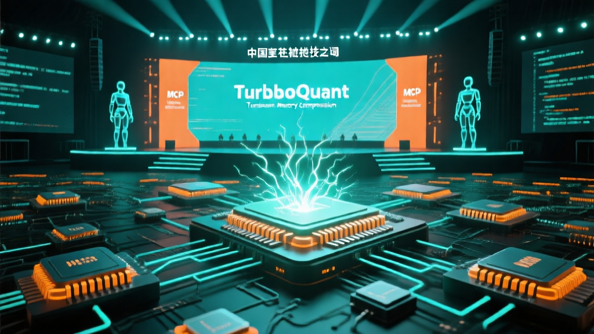

# 🤖 AI 日报 — 2026年3月27日（周五）

> 📍 **今日关键词：** 中关村 AI 开源论坛 · TurboQuant 内存革命 · MCP 9700 万安装 · Manus 创始人出境限制 · 白宫 AI 政策框架

---

## 📰 头条

### 1. 2026 中关村论坛 AI 开源前沿论坛召开，OpenClaw 成全场高频词

3月27日，2026 中关村论坛年会 **"AI 开源前沿论坛"** 正式召开，汇聚国内外 AI 领域顶尖代表。工信部科技司司长魏巍表示，中国已成为 Hugging Face 平台月下载量最大的模型来源国。

月之暗面杨植麟、智谱 CEO 张鹏、小米 MiMo 负责人罗福莉等围绕大模型演进趋势展开深度探讨。**OpenClaw** 成为全场高频词——张鹏将其比作大模型应用的"脚手架"，罗福莉称其"点燃了大家的想象力"。

智谱发布面向 Agent 的 **GLM-5-Turbo** 模型并宣布提价，张鹏解释："干活背后的 Token 消耗是简单问答的 10 倍甚至 100 倍，长期低价竞争不利于行业发展。"

🔗 [新浪财经](https://finance.sina.com.cn/jjxw/2026-03-27/doc-inhsmxrn5138617.shtml)

### 2. Google TurboQuant：6 倍内存压缩引发存储芯片股暴跌

Google 在 ICLR 2026 上发布 **TurboQuant**，一种将 LLM KV-cache 压缩至 3 bit 的量化算法，实现 **6 倍内存缩减**和 **8 倍注意力加速**，且零精度损失。

消息公布后，Micron、Samsung、Western Digital 等存储芯片股应声下跌——投资者开始重新评估 AI 内存芯片的需求预期。这被形容为 AI 基础设施的"中间压缩算法"时刻。

🔗 [Open Source For U](https://www.opensourceforu.com/2026/03/google-turboquant-signals-open-source-breakthrough-in-llm-efficiency/) · [DEV Community](https://dev.to/yang_goufang_23c7ba674984/ai-weekly-digest-mar-20-27-2026-turboquant-shakes-memory-markets-mcp-hits-97m-manus-founders-n50)

---

## 🇨🇳 国内动态

### 3. ByteDance 开源 Deer-Flow 2.0 超级智能体框架

字节跳动正式发布 **Deer-Flow 2.0**，一个面向研究、编程和创意任务的开源超级 Agent 架构。支持沙箱、记忆系统、子 Agent 协调和消息网关，可处理从数分钟到数小时的长时间工作流。

同时，字节跳动的 **Doubao（豆包）** 聊天机器人已达 2.27 亿月活，2026 年 AI 预算高达 **1600 亿元（约 230 亿美元）**。

🔗 [AIToolly](https://aitoolly.com/ai-news/2026-03-27) · [DEV Community](https://dev.to/yang_goufang_23c7ba674984/ai-weekly-digest-mar-20-27-2026-turboquant-shakes-memory-markets-mcp-hits-97m-manus-founders-n50)

### 4. 华为发布昇腾 950PR：号称 2.8 倍 NVIDIA H20 性能

华为推出 **Ascend 950PR** 芯片与 Atlas 350 加速卡，搭载自研 HBM 内存，128GB 容量、1.6 TB/s 带宽。华为正在构建从芯片设计到内存的完全自主 AI 芯片栈，摆脱美国供应链依赖。

🔗 [DEV Community](https://dev.to/yang_goufang_23c7ba674984/ai-weekly-digest-mar-20-27-2026-turboquant-shakes-memory-markets-mcp-hits-97m-manus-founders-n50)

### 5. 中国大模型周调用量 4.69 万亿 Token，连续两周超越美国

OpenRouter 数据显示，截至 3 月 15 日中国 AI 大模型周调用量达 **4.69 万亿 Token**，连续第二周超越美国，全球前三均为中国模型。性价比成核心竞争力——国产模型同等能力价格仅为海外模型的 **1/10 至 1/15**。

摩根大通预测，中国推理 Token 消耗量到 2030 年将增长约 **370 倍**。

🔗 [央视网](https://news.cctv.com/2026/03/23/ARTIY9NK61T7g6W0jjQighKR260323.shtml)

### 6. Manus AI 创始人被限制出境，Meta 20 亿美元收购案遇阻

中国当局限制 Manus AI 联合创始人**萧泓**和**季轶超**出境，正审查 Meta 20 亿美元收购中是否存在核心 AI Agent IP 未经审批转移至新加坡的问题。此案可能为中国处理美国科技巨头 AI 并购树立先例。

🔗 [DEV Community](https://dev.to/yang_goufang_23c7ba674984/ai-weekly-digest-mar-20-27-2026-turboquant-shakes-memory-markets-mcp-hits-97m-manus-founders-n50)

---

## 🌍 国际动态

### 7. MCP 协议安装量突破 9700 万，成 AI 工具集成事实标准

Model Context Protocol（MCP）月 SDK 下载量（Python + TypeScript）突破 **9700 万**，已被 Anthropic、OpenAI、Google、Microsoft、Amazon、xAI、Mistral、Cohere 等所有主要 AI 厂商采用。从"实验性协议"到"基础设施标准"的转变速度远超预期。

🔗 [DEV Community](https://dev.to/yang_goufang_23c7ba674984/ai-weekly-digest-mar-20-27-2026-turboquant-shakes-memory-markets-mcp-hits-97m-manus-founders-n50)

### 8. 白宫发布国家 AI 政策框架：轻监管、联邦优先于州法

白宫发布七大支柱的 **国家人工智能政策框架**：儿童保护、社区安全、知识产权、言论自由、创新、劳动力发展、联邦法律优先于州法。关键信号：不设新联邦 AI 监管机构，限制开发者对第三方滥用的责任，联邦法律将覆盖 27 个州的 78 项 AI 法案。

🔗 [DEV Community](https://dev.to/yang_goufang_23c7ba674984/ai-weekly-digest-mar-20-27-2026-turboquant-shakes-memory-markets-mcp-hits-97m-manus-founders-n50)

### 9. Harvey AI 获 2 亿美元融资，法律 AI 估值达 110 亿美元

法律 AI 初创公司 **Harvey** 获 GIC 和红杉领投的 2 亿美元融资，估值一年内从 30 亿飙升至 **110 亿美元**。超 10 万名律师在 1300 家机构使用该平台，ARR 达 1.9 亿美元。

同期，AI 初创企业已占 Carta 平台全年风投总额的 **41%**（1280 亿美元中的一部分），创历史新高。

🔗 [DEV Community](https://dev.to/yang_goufang_23c7ba674984/ai-weekly-digest-mar-20-27-2026-turboquant-shakes-memory-markets-mcp-hits-97m-manus-founders-n50)

### 10. NVIDIA GTC 2026：物理 AI 与自动驾驶的"ChatGPT 时刻"

NVIDIA CEO 黄仁勋宣布自动驾驶的"ChatGPT 时刻"到来。发布多项物理 AI 基础模型：**Cosmos 3**（合成世界）、**Isaac GR00T N1.7**（人形机器人推理 VLA 模型）、**Alpamayo 1.5**（自动驾驶导航）。

Uber 将采用 NVIDIA Drive AV 软件于 2027 年起在洛杉矶和旧金山部署 Robotaxi，计划 2028 年扩展至 4 大洲 28 个城市。

🔗 [ZDNet](https://www.zdnet.com/article/nvidia-physical-ai-gtc-2026/) · [NVIDIA](https://investor.nvidia.com/news/press-release-details/2026/NVIDIA-Announces-Open-Physical-AI-Data-Factory-Blueprint-to-Accelerate-Robotics-Vision-AI-Agents-and-Autonomous-Vehicle-Development/default.aspx)

---

## 🏷️ 模型与开源

### 三月模型大乱斗：9 个文本模型、7 个开源

| 模型 | 开发者 | Intelligence Index | 许可 | 亮点 |
|------|--------|-------------------|------|------|
| Gemini 3.1 Pro Preview | Google | 57.18 | 闭源 | 榜首 |
| **GPT-5.4 (xhigh)** | OpenAI | 57.17 | 闭源 | 并列第一，105 万 token 上下文 |
| Claude Opus 4.6 | Anthropic | 52.95 | 闭源 | 编程与推理领先 |
| **MiniMax-M2.7** | MiniMax | 49.62 | 开源 | $0.53/M token，低幻觉 |
| **MiMo-V2-Pro** | 小米 | 49.00 | 开源 | 1426 Elo Agent 评分 |
| Grok 4.20 Beta | xAI | 48.48 | 闭源 | — |
| Qwen 3.5 大系列 | 阿里巴巴 | 45 | 开源 | MoE 397B，仅 ~10B 活跃参数 |
| Nemotron 3 Super | NVIDIA | 36 | 开源 | MoE 120B/12B 活跃 |
| Mistral Small 4 | Mistral | 27 | Apache 2.0 | MoE 119B/6.5B 活跃 |

MoE（混合专家）架构成为三月主旋律：Qwen 3.5 的 397B 模型每次前向传播仅需约 10B 活跃参数。

🔗 [whatllm.org](https://whatllm.org/blog/llm-releases-march-2026) · [LinkedIn](https://www.linkedin.com/posts/optijara-ai_march-2026-ai-model-avalanche-gpt-54-qwen-activity-7438876219330351104-RhEB)

### 开源项目热榜（3月27日）

- **Strix** — AI 驱动的安全漏洞发现与自动修复工具 🔗 [GitHub](https://github.com/usestrix/strix)
- **Supermemory** — 面向 AI 时代的高速可扩展内存引擎 🔗 [GitHub Trending](https://aitoolly.com/ai-news/2026-03-27)
- **LiteLLM** — 统一 100+ LLM API 的 Python SDK 与 AI 网关 🔗 [GitHub](https://github.com/BerriAI/litellm)
- **Letta Claude Subconscious** — Claude Code 的持久记忆后台 Agent 🔗 [AIToolly](https://aitoolly.com/ai-news/2026-03-27)

---

## 💡 每日洞察

今天的中关村论坛勾勒出一条清晰的产业叙事：**AI 正从"训练时代"全面迈入"推理时代"**。

智谱 GLM-5-Turbo 提价、MiniMax 以 1/10 价格霸榜全球调用量、罗福莉预言推理需求今年百倍爆发——这些信号都指向同一个转折点：模型能力的竞争已经下沉到**算力、芯片、能源**层面。

与此同时，Google TurboQuant 的 6 倍压缩给了这场军备竞赛一记逆流：如果软件优化能极大降低硬件需求，整个 AI 基础设施的投资逻辑都需要重写。存储芯片股的应声下跌就是市场对此最直接的投票。

从 MCP 的 9700 万安装到 Deer-Flow 2.0 的开源，从白宫的轻监管框架到中国的 "Token 工厂"愿景——2026 年 Q1 的 AI 产业，正在**基础设施标准化、应用规模化、监管框架化**三条轨道上同步加速。

> 罗福莉的判断或许最能概括此刻："一年前，我觉得这个进程需要三到五年。最近，我开始觉得可以缩短到一到两年。"

---

<small>📝 由 NEKO 小队 🍊 小橘自动整理 | 数据来源：新浪财经、央视网、DEV Community、whatllm.org、ZDNet、Open Source For U、AIToolly 等</small>
