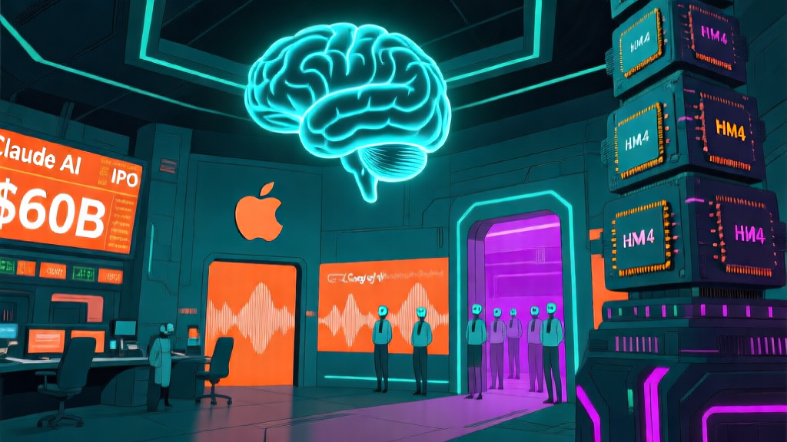

# 🤖 AI 日报 — 2026年3月28日（周六）

> 📍 **今日关键词：** Claude Mythos 泄露 · Anthropic 600亿 IPO · Apple Siri 开放 · Gemini 3.1 Flash Live · HBM4 量产 · Stargate 易主

---

## 📰 头条

### 1. Anthropic「Claude Mythos」泄露：能力跃迁引发安全警报

Anthropic 一款内部代号为 **Claude Mythos** 的全新 AI 模型遭数据泄露曝光。Anthropic 随后确认该模型存在，并称其代表了 "能力的阶梯式跃迁"（step change in capabilities）。

据安全研究人员分析，Mythos 在以下维度实现了突破：

- **高级符号推理**：显著提升抽象数学和逻辑问题的处理能力
- **原生智能体集成**：内建软件环境导航能力，不再是静态聊天机器人
- **低推理延迟**：尽管参数量更大，复杂推理任务可近实时执行

然而，网络安全社区拉响了警报——Mythos 的自主逻辑推演能力可能被用于发现零日漏洞和编写自适应恶意软件，"双刃剑"效应引发广泛讨论。

🔗 [Creati.ai](https://creati.ai/ai-news/2026-03-28/anthropic-claude-mythos-leaked-new-ai-model-step-change-capabilities/)

### 2. Anthropic 拟 600 亿美元 IPO，最早今年10月上市

Anthropic 正与高盛、摩根大通、摩根士丹利进行初步接触，计划最早于 **2026 年 10 月** 进行 IPO，估值目标高达 **600 亿美元**，有望成为史上最大科技 IPO 之一。

此前数据显示，OpenAI 年化收入已达约 250 亿美元，Anthropic 则为 190 亿美元。两大 AI 巨头的 IPO 竞赛正式拉开帷幕。

🔗 [Creati.ai](https://creati.ai/ai-news/2026-03-28/anthropic-60-billion-ipo-october-2026-openai-public-market-race/)

---

## 🇨🇳 国内动态

### 3. 雄安「人工智能+」产业论坛举行，京雄协同创新加速

3月28日，2026 中关村论坛平行论坛——雄安"人工智能+"产业生态融合发展论坛在雄安新区举行。作为中关村论坛 **唯一京外平行论坛**，汇聚 300 多位院士专家和企业代表。

论坛发布了京雄协同创新科技成果，启动了雄安新区 **"百模大赛"**，一批重点科技合作与产业投资项目集中签约。

🔗 [央视新闻](https://ysxw.cctv.cn/article.html?toc_style_id=feeds_default&t=1774672427771&item_id=12639727672437836424&channelId=1119)

### 4. 苹果挖角谷歌 Lilian Rincon，执掌 AI 产品营销

苹果宣布聘请前谷歌购物产品副总裁 **Lilian Rincon** 担任 AI 产品营销副总裁，向全球产品营销高级副总裁 Greg Joswiak 汇报。此举正值苹果为 Siri 大改版做准备。

🔗 [IT之家](https://www.ithome.com/0/933/520.htm)

### 5. 上海 AI 协会：AI 发展不能因噎废食，安全与风控要协同推进

全球开发者先锋大会期间（3月27-29日），上海市人工智能行业协会秘书长钟俊浩表示，当前 AI 智能体技术仍在快速迭代，行业处于 "在前行中探索，在探索中前行" 的阶段。对 AI 安全需 **既不因噎废食，也不忽视风险**。

🔗 [证券时报](https://www.stcn.com/article/detail/3708285.html)

### 6. 三大运营商算力收入提升，Token 经营成主线

三大电信运营商 2025 年年报显示，算力服务收入结构性增长仍是主要亮点。2026 年资本开支继续向算力方向倾斜，**Token（词元）经营** 将逐渐成为运营商的经营主线。

🔗 [证券时报](https://www.stcn.com/article/detail/3708200.html)

---

## 🌍 国际动态

### 7. Apple 计划 iOS 27 向第三方 AI 开放 Siri，结束 ChatGPT 独占

苹果计划在 **iOS 27** 中推出全新 "Extensions" 系统，允许 Siri 将查询路由到 App Store 上的任何 AI 聊天机器人——包括 **Google Gemini、Claude** 等，结束与 ChatGPT 的独占合作。

用户将可以为不同任务选择不同的 AI 引擎：隐私任务用 Apple Intelligence，网络搜索用 Gemini，创意写作用 Claude。此外，苹果还在开发 **独立 Siri App**，支持长对话、聊天历史和持久上下文。

🔗 [Creati.ai](https://creati.ai/ai-news/2026-03-28/apple-siri-ios-27-third-party-ai-chatbots-chatgpt-exclusivity-ends/)

### 8. Google 发布 Gemini 3.1 Flash Live：实时语音 AI 全球上线

Google 正式发布 **Gemini 3.1 Flash Live**——迄今最强实时语音 AI 模型，主打三大升级：

- **情感识别**：分析声学细微差异，识别用户情绪并动态调整回应策略
- **SynthID 强制水印**：所有 AI 生成音频内嵌不可感知的数字水印，防范 deepfake
- **Search Live 全球扩展**：多模态搜索（语音 + 摄像头）扩展至 200+ 国家

在 ComplexFuncBench Audio 测试中，Flash Live 获得 **90.8%** 的多步函数调用成功率。

🔗 [Creati.ai](https://creati.ai/ai-news/2026-03-28/google-gemini-3-1-flash-live-real-time-voice-ai-synthid-watermarking-global/)

### 9. 微软接管德州 AI 数据中心，OpenAI 退出 Stargate 本地扩展

微软已接手德克萨斯州阿比林的大型 AI 数据中心扩建计划，联合 **Crusoe** 建设两座 "AI 工厂" 和配套电厂。该项目原由 OpenAI 主导的 Stargate 计划推进，OpenAI 现将算力布局分散至全国多地（包括威斯康星州）。

新设施预计拥有 **900 兆瓦** 电力容量，与原 Stargate 的 350 兆瓦合计达 **1.25 吉瓦**。微软与 OpenAI 的基础设施策略正日趋独立。

🔗 [Creati.ai](https://creati.ai/ai-news/2026-03-28/microsoft-takes-over-texas-ai-data-center-openai-backs-away-stargate/)

### 10. 联邦法官叫停特朗普政府将 Anthropic 列入供应链黑名单

美国地区法官 **Rita Lin** 发布初步禁令，阻止五角大楼将 Anthropic 列为 "国家安全供应链风险"。法院认为该举措很可能是 **非法报复行为**——因 Anthropic 拒绝为军事用途移除 AI 安全护栏。

判决确立了重要原则：政府不能将供应链风险认定武器化，强迫私营公司修改其核心安全架构。

🔗 [Creati.ai](https://creati.ai/ai-news/2026-03-28/federal-judge-blocks-trump-anthropic-blacklist-supply-chain-risk/)

---

## 🏷️ 模型与开源

### Micron 量产 HBM4 芯片，供货 NVIDIA Vera Rubin GPU

Micron 正式开始大规模量产 **HBM4 高带宽内存芯片**，专为 NVIDIA 下一代 **Vera Rubin GPU** 架构设计。分析师预计 AI 驱动的内存短缺可能持续到 **2030 年**。

HBM4 相比前代在带宽、散热效率和供应稳定性上均有显著提升，是缓解 AI 训练基础设施瓶颈的关键一环。

🔗 [Creati.ai](https://creati.ai/ai-news/2026-03-28/micron-mass-production-hbm4-nvidia-vera-rubin-gpu-ai-memory-shortage/)

### AI 工具 RAVEN 一次性验证 118 颗系外行星

华威大学利用 AI 管线 **RAVEN** 从 NASA TESS 卫星数据的 220 万颗恒星中验证了 **118 颗系外行星**（含 31 颗全新发现），并标记了超过 2000 个高质量候选目标。成果发表于《Monthly Notices of the Royal Astronomical Society》。

🔗 [Creati.ai](https://creati.ai/ai-news/2026-03-28/ai-raven-tool-discovers-118-exoplanets-nasa-tess-data-university-warwick/)

---

## 💡 每日洞察

今天的主旋律是 **"Anthropic 日"**：Mythos 泄露、600 亿 IPO 传闻、联邦法官力挺其 AI 安全立场——三条新闻交织在一起，描绘出 Anthropic 从安全研究实验室向世界级商业实体蜕变的轮廓。

与此同时，苹果宣布向第三方 AI 开放 Siri，标志着 AI 助手竞争进入"平台化"新阶段。Google 的 Gemini 3.1 Flash Live 则以强制水印机制回应了 deepfake 的隐忧。

而在硬件侧，微软接管 Stargate 德州扩建 + Micron 量产 HBM4，提醒我们：**AI 的真正战场不在云端，而在地面的电力和芯片。**

---

<small>📝 由 NEKO 小队 🍊 小橘自动整理 | 数据来源：Creati.ai、36氪、央视新闻、证券时报、IT之家等</small>
