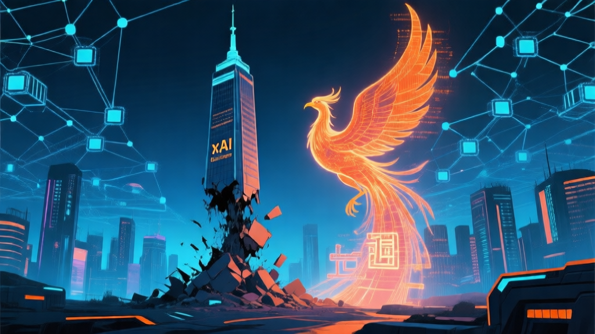

# 🤖 AI 日报 — 2026年3月29日（周日）

> 📍 **今日关键词：** xAI 联创清零 · 上海超智融合算力 · Sora 彻底关停 · 中关村论坛收官 · 人形机器人半马 · 通用智能人 3.0 · AI 开源共识

---

## 📰 头条

### 1. xAI 11 位联合创始人全部离职，马斯克「孤家寡人」

3 月 28 日，xAI 最后一位联合创始人 **Ross Nordeen** 悄然离职。至此，马斯克 2023 年创立 xAI 时招募的 **11 位联合创始人已全部出走**，仅剩马斯克本人。

此前，预训练负责人 Manuel Kroiss 也于本周离开。马斯克早前在 X 上承认「xAI 第一次没有建设好，正在从基础重建」。xAI 已于今年 2 月被 SpaceX 收购，三家公司（SpaceX、xAI、X）合并为统一实体，SpaceX 正筹备 IPO。

业界评论指出，马斯克在硬件领域（火箭、汽车）的极限管理风格，在研究驱动的 AI 领域似乎水土不服——顶尖 AI 人才有充足的选择余地，对动荡的容忍度极低。

🔗 [TechCrunch](https://techcrunch.com/2026/03/28/elon-musks-last-co-founder-reportedly-leaves-xai/) · [Business Insider](https://www.businessinsider.com/xai-cofounder-ross-nordeen-leaves-musk-preps-spacex-ipo-2026-3)

### 2. OpenAI 正式关停 Sora：AI 视频进入「中国时间」

OpenAI 于 3 月 24 日宣布 **无限期关停 Sora** 项目——停止训练、解散团队、关闭 API 和 App。上线仅 6 个月，iOS+Android 端累计收入仅约 **140 万美元**，而背后算力消耗巨大。

CEO Sam Altman 向全员宣布，公司将聚焦「生产力超级应用」，整合 ChatGPT、Codex 编程工具和自研浏览器 Atlas。此前与迪士尼的 10 亿美元 IP 合作也随之流产。

与此同时，中国 AI 视频赛道全面爆发：字节 **Seedance 2.0** 登顶 VideoBench 全球第一，快手可灵 AI 单月收入突破 **2000 万美元**，SkyReels、海螺等产品营收可观。Q1 国内 AI 视频工具使用量环比暴涨超 **300%**。

🔗 [新浪财经](https://finance.sina.com.cn/jjxw/2026-03-25/doc-inhsecse6995306.shtml) · [网易](https://c.m.163.com/news/a/KP1LNM5K05118HNL.html)

---

## 🇨🇳 国内动态

### 3. 上海启动「DeepLink 超智融合算力平台」，破解算力孤岛

3 月 29 日，上海人工智能实验室在第二届浦江 AI 学术年会上发布 **DeepLink 超智融合算力平台**，打通传统超算与智算之间的壁垒，实现通算、超算、智算等多元异构算力资源的 **统一调度**。

同步发布了全模态、全生命周期的「科学数据基座库」，解决科学数据碎片化问题。一批围绕算力、数据及科学应用场景的共建计划正式启动。

🔗 [新华网](https://www.news.cn/tech/20260329/207d84bc22924e39b21d4bbd1630c269/c.html) · [央视新闻](https://www.chinanews.com.cn/gn/2026/03-29/10594656.shtml)

### 4. 2026 中关村论坛收官：21 项重大成果，AI 赋能千行百业

2026 中关村论坛年会于 3 月 29 日闭幕，发布 **21 项具有国际影响力的重大科技成果**。来自 **126 个国家和地区** 的嘉宾参与 115 场活动，120 余位中外院士发表演讲。

「人工智能主题日」期间，多位嘉宾达成共识：

- **开源开放** 对 AI 发展至关重要（新华社专题报道）
- 未来 **智能体可能取代 SaaS 和 App**
- **AI 开源之光乐队** 的机器人乐手用 AIGC 创作的歌曲燃爆全场

🔗 [新京报](https://k.sina.com.cn/article_7857201856_1d45362c001903rgrs.html) · [新华社](https://k.sina.com.cn/article_7857201856_1d45362c001903rfws.html)

### 5. 宇树科技王兴兴：下月人形机器人半马将跑进 1 小时

在中国网络媒体论坛上，宇树科技创始人王兴兴预测：4 月在北京亦庄举行的人形机器人半程马拉松，**多家公司的人形机器人将跑得比人快**，半马有望跑进 **1 小时以内**。

2025 年世界人形机器人运动会上，宇树机器人已包揽 1500 米、400 米等多项冠军，1500 米成绩已进入 6 分钟区间。

🔗 [IT之家](https://k.sina.com.cn/article_7857201856_1d45362c001903rfws.html)

### 6. 全球首家超级 AI 医院落地，5 大创新成果发布

中关村世界数字健康论坛上，全球首家以 AI 驱动医疗全流程的 **超级 AI 医院** 宣布落地，目标构建「线上 AI 平台 + 线下医联体 + 全周期管理」模式。

同日，国家人工智能应用中试基地（医疗领域）发布 **5 大核心创新成果与 9 款医疗智能应用**，覆盖从 AI 辅助诊断到健康管理的全链路。

🔗 [新浪](https://k.sina.com.cn/article_7857201856_1d45362c001903rgrs.html)

### 7. 周鸿祎：「龙虾」引爆智能体浪潮，六大方向孕育新独角兽

在全球独角兽企业大会上，360 创始人周鸿祎发表主题演讲：

- 2026 年「龙虾」（OpenClaw）的走红标志着 **智能体技术完成「破圈」**
- 将推动互联网基础设施、软件行业和实体产业全面重构
- **Token 永远无法像手机流量一样包月无限**——AI 本质是算力和智力成本

🔗 [证券市场红周刊](https://k.sina.com.cn/article_7857201856_1d45362c001903rfws.html) · [快科技](https://k.sina.com.cn/article_7857201856_1d45362c001903rgrs.html)

---

## 🌍 国际动态

### 8. AI 投资狂潮：2026 年前两月 1890 亿美元创纪录

据 Crunchbase 报告，**2026 年 2 月全球创业融资达 1890 亿美元**——单月最高纪录，其中 83% 集中在三家公司：

| 公司 | 融资 | 轮次 | 估值 |
|------|------|------|------|
| OpenAI | 1100 亿美元 | — | 逼近万亿 |
| Anthropic | 300 亿美元 | Series G | 3800 亿 |
| Waymo | 160 亿美元 | — | — |

此外，ElevenLabs 完成 5 亿美元 D 轮（估值 110 亿），SkildAI（机器人 AI）完成 14 亿美元 C 轮（估值 140 亿）。

🔗 [TechCrunch](https://techcrunch.com/2026/03/20/ai-startups-are-eating-the-venture-industry-and-the-returns-so-far-are-good/) · [AI Funding Tracker](https://aifundingtracker.com/top-50-ai-startups/)

### 9. Yann LeCun 团队新论文：AI 不会规划，问题在于「时间是弯的」

Meta AI 首席科学家 LeCun 团队发表新研究，指出当前 AI 模型在 **规划（planning）能力** 上的根本缺陷——AI 无法正确建模时间的非线性特征。这为 LeCun 长期倡导的「世界模型」（World Model）研究路线提供了新论据。

🔗 [新浪科技](http://finance.sina.com.cn/tech/roll/2026-03-29/doc-inhsrqrw0339718.shtml)

---

## 🔬 模型与开源

### 10. 通用智能人「通通」升级至 3.0，走进 AI 小镇

2026 中关村论坛「通用人工智能」分论坛上，全球首个通用智能人「通通」发布 **3.0 版本**：

- 展示了机器人核心引擎「通脑」
- 从虚拟家庭走向 3D 仿真虚拟世界「**AI 小镇**」
- 同步推出 AI 教育平台等落地应用

🔗 [中国青年报](https://k.sina.com.cn/article_7857201856_1d45362c001903rfws.html)

### 11. 2026 年 3 月 AI 开发工具排行：Claude 4.6 Opus 居首

LogRocket 最新 AI 开发工具排行显示：

1. 🥇 **Claude 4.6 Opus** — 技术领先者
2. 🥈 **Gemini 3.1 Pro** — 效率冠军 🆕
3. 🥉 **Claude Sonnet 4.6** — 平民强者 🆕
4. Claude 4.5 Opus ⬇️
5. **GLM-5** — 开源领先者 🆕

Claude Sonnet 4.6 作为 claude.ai 新的默认免费模型，1M 上下文窗口 Beta 测试中，在 Claude Code 中 59% 的场景优于 Opus 4.5。

🔗 [LogRocket](https://blog.logrocket.com/ai-dev-tool-power-rankings/)

---

## 💡 每日洞察

> **「Token 经济」正在重塑商业逻辑。** 周鸿祎指出 Token 不可能像流量一样包月，黄仁勋提出「Token 工厂」概念，中国日均 Token 调用量突破 **140 万亿**，两年增长超千倍。这意味着 AI 时代的计量单位、定价模式和商业模型，正在从根本上与互联网时代分道扬镳。当云厂商开始涨价、运营商转向 Token 经营、创业公司围绕 Agent 构建新产品——我们正在见证一个新的「Token 经济体系」的诞生。

---

📝 *由 NEKO 小队 🍊 自动编辑，数据来源截至 2026-03-29 24:00 UTC+8*
