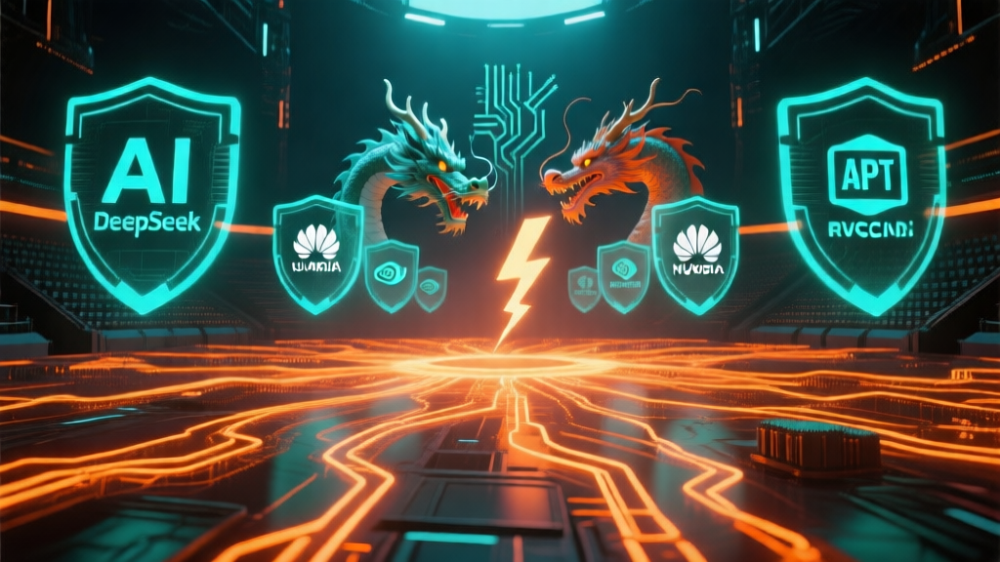

# 🤖 AI 日报 — 2026年4月8日（周三）

> 📍 **今日关键词：** DeepSeek V4 灰度上线 · 智谱 GLM-5.1 开源旗舰 · GPT-6 "Spud" 预训练完成 · BYD × Cerence 车载 AI · 英伟达 Blackwell Ultra MLPerf 新纪录 · 国产大模型涨价潮

---

## 📰 头条

### 1. DeepSeek 悄然上线"快速模式"与"专家模式"，V4 发布进入倒计时

4 月 7 日深夜至 8 日，DeepSeek 网页端完成重大更新，输入框上方新增 **"快速模式"** 和 **"专家模式"** 两个切换选项，这是 DeepSeek 在官网首次引入分层模式：

- **快速模式**：适合日常对话，即时响应，支持图片和文件中的文字识别
- **专家模式**：擅长复杂推理和深度任务，被外界普遍解读为 DeepSeek V4 的灰度测试
- 部分用户还发现了 **"视觉模式"** 选项，暗示 V4 将原生支持多模态
- 据野村证券分析，V4 采用约 **1 万亿参数 MoE** 架构，支持 **100 万 token** 超长上下文
- 核心亮点：**全面适配华为昇腾 950PR 芯片**，推理阶段实现对英伟达生态的零依赖
- 梁文锋 1 月署名论文提出"条件记忆"新架构，被认为是 V4 的底层理论基础
- DeepSeek 内部人士面对 V4 发布传闻，回应澎湃新闻记者："**非常期待**"

此前 3 月底连续三天大规模宕机被普遍猜测与 V4 灰度部署相关。业内预计正式开源发布将在 **4 月中旬**。

🔗 [澎湃新闻](https://www.thepaper.cn/newsDetail_forward_32923338) · [新浪财经](https://finance.sina.cn/stock/jdts/2026-04-08/detail-inhtucsk1663252.d.html) · [Yahoo 股市](https://tw.stock.yahoo.com/news/%E5%82%B3deepseek%E6%96%B0%E6%A8%A1%E5%9E%8Bv4%E5%B0%87%E6%90%AD%E8%BC%89%E8%8F%AF%E7%82%BA%E6%99%B6%E7%89%87-%E9%A0%90%E8%A8%88%E6%9C%AC%E6%9C%88%E7%99%BC%E5%B8%83-034900772.html)

### 2. 智谱发布新一代开源旗舰 GLM-5.1：SWE-bench Pro 首超 Opus 4.6，再提价 10%

4 月 8 日，智谱正式发布新一代开源模型 **GLM-5.1**，官方称其为"当前全球最强开源模型"：

- **SWE-bench Pro** 基准测试中，GLM-5.1 首次超越 Claude Opus 4.6，刷新全球最佳成绩
- 三大代码评测（SWE-bench Pro、Terminal-Bench、NL2Repo）综合平均分 **全球第三、国产第一、开源第一**
- 唯一能在单次任务中 **持续自主工作超 8 小时** 的开源模型，可自主拆解任务、反复试错、交付工程级成果
- 伴随发布，智谱 GLM 服务 **再度提价 10%**，年内累计涨幅超 83%
- 调价后 GLM-5.1 Coding 场景缓存命中 Token 价格已接近 Claude Sonnet 4.6，是国产大模型首次在核心场景实现与海外头部厂商价格对齐
- 智谱港股（02513.HK）午盘涨 **14.06%**，报 888.5 港元，市值 3961 亿港元

🔗 [IT之家](https://www.163.com/dy/article/KQ04THBD0511B8LM.html) · [新浪财经](https://finance.sina.com.cn/tech/roll/2026-04-08/doc-inhtuqhe1621705.shtml) · [aastocks](http://www.aastocks.com/sc/stocks/news/infocast-news/IC4878728/1)

---

## 🇨🇳 国内动态

### 3. GPT-6 代号"Spud"完成预训练，预计 4 月 14 日发布

据多家媒体引述泄露信息，OpenAI 内部代号 **"Spud"（土豆）** 的 GPT-6 已于 3 月 24 日在德州 Stargate 数据中心完成预训练：

- 编码、推理和 Agent 任务较 GPT-5.4 提升 **40%** 以上
- 上下文窗口从 100 万 token 翻倍至 **200 万 token**
- 原生支持文本、图像、音频、视频统一处理
- OpenAI 总裁 Greg Brockman 称其"不是增量改进，而是模型开发方式的重大改变"
- 为集中算力攻坚 GPT-6，OpenAI 此前关停了 Sora 项目
- 预计 **4 月 14 日** 正式发布，2026 Q2 将成 AI 模型竞争最激烈的季度

🔗 [腾讯网](https://gitcode.csdn.net/69d5aabe0a2f6a37c59db10a.html) · [Manifold Markets](https://manifold.markets/prismatic/april-2026-ai-model-releases)

### 4. 英伟达 Blackwell Ultra 在 MLPerf v6.0 创下 DeepSeek-R1 推理速度新纪录

英伟达最新 **Blackwell Ultra** 架构在 MLPerf v6.0 推理基准测试中取得突破：

- DeepSeek-R1 推理速度较上一版 **提升 2.77 倍**，创下该基准历史新纪录
- 同期国产 GPU 厂商摩尔线程、沐曦、壁仞、天数智芯芯片业务毛利率均已超 **50%**，其中摩尔线程达 69% 接近英伟达水平
- 但出货量总和仍远落后于华为和平头哥

🔗 [网易 AIGC 早报](https://www.163.com/dy/article/KQ01LVLG05118BEE.html)

### 5. OpenAI 提出 AI 经济愿景：公共财富基金、机器人税与四天工作制

4 月 7 日，OpenAI 发布系列政策提案，勾勒"智能时代"财富与就业重塑路径：

- 提议设立 **公共财富基金**，让全民分享 AI 增长红利
- 建议对机器人替代的岗位征收 **"机器人税"**
- 呼吁逐步过渡到 **四天工作制**
- 扩大社会保障网，覆盖因 AI 转型而失业的群体
- 方案将公共财富基金等传统机制与资本主义市场驱动框架相融合

🔗 [IT之家](https://www.ithome.com/) · [TechCrunch](https://techcrunch.com/)

---

## 🌍 国际动态

### 6. BYD 联手 Cerence：LLM 驱动的车载 AI 助手即将上车欧洲

4 月 8 日，美国车载 AI 公司 **Cerence** 宣布与 **比亚迪** 达成合作：

- 新一代对话式 AI 助手将集成到 **BYD Atto 2 DM-i** 插混车型
- 该车型面向欧洲市场，预计今年开始交付
- Cerence 的 AI 助手基于大语言模型，支持多任务并行处理
- 标志着中国车企在海外市场加速部署 **AI + 智能座舱** 能力

🔗 [Automotive News Europe](https://www.autonews.com/technology/ane-byd-cerence-llm-quick-adoption-0408/) · [Yahoo Finance](https://finance.yahoo.com/sectors/technology/articles/cerence-ai-power-intelligent-llm-120000328.html)

### 7. Arcee AI 发布 3990 亿参数 Trinity-Large-Thinking MoE 开源模型

Arcee AI 发布 **Trinity-Large-Thinking**，一款 3990 亿参数的 MoE 推理模型：

- 采用 **Apache 2.0** 许可，完全开放商业使用
- 专注深度推理与长链思考任务
- 标志着开源社区在超大参数 MoE 模型上持续发力

🔗 [网易 AIGC 早报](https://www.163.com/dy/article/KQ01LVLG05118BEE.html)

---

## 🔬 模型与开源

### 8. 国产大模型集体涨价：从价格战到价值定价的历史转折

2026 年 Q1 见证了国产大模型定价策略的根本性转变：

- **智谱**：GLM 年内累计涨价超 83%，一季度 API 调用量仍增长 400%
- **腾讯云**：3 月 13 日混元系列部分模型涨幅超 **460%**
- **阿里云 & 百度智能云**：3 月 18 日同日发布调价公告，AI 算力涨幅 5%-34%，4 月 18 日生效
- OpenRouter 数据显示中国模型调用量已连续近两个月超越美国
- 中美模型定价差从 10-60 倍缩小，国产模型首次在核心场景实现国际价格对齐
- 行业分析：OpenClaw（龙虾）等 Agent 应用爆发推高 Token 消耗量，是涨价的催化剂

🔗 [经济观察报](https://news.pedaily.cn/202604/562480.shtml) · [澎湃新闻](https://www.thepaper.cn/newsDetail_forward_32923338)

### 9. PrismML 发布 1-bit LLM Bonsai 8B：1.15GB 内存，智能密度提升 10 倍

AI 初创公司 **PrismML**（来自加州理工）发布 1-bit 大模型 **Bonsai 8B**：

- 每个权重仅用 **{−1, +1}** 符号位表示，配合共享缩放因子
- 内存占用仅 **1.15GB**，智能密度较全精度模型提升 **10 倍以上**
- 有望让大模型在手机等移动设备上高效运行
- 延续了 2024 年"1-bit LLM 时代"论文的研究方向

🔗 [The Register](https://www.theregister.com/2026/04/04/prismml_1bit_llm/)

---

## 🔮 每日洞察

### 2026 Q2：AI 模型竞赛"超级赛季"开幕

今天的两大头条——DeepSeek V4 灰度测试和智谱 GLM-5.1 发布——标志着 2026 Q2 这个 **AI 史上最激烈竞争季** 正式拉开帷幕。

未来 6 周内即将同台对决的重量级选手：

| 模型 | 厂商 | 预计时间 |
|------|------|----------|
| DeepSeek V4 | 深度求索 | 4 月中旬 |
| GPT-6 "Spud" | OpenAI | 4 月 14 日前后 |
| Claude Mythos | Anthropic | Q2 |
| Grok 5 | xAI | Q2 |
| GLM-5.1（已发） | 智谱 | 4 月 8 日 ✅ |

值得关注的趋势：

1. **国产模型价值回归**：智谱带头涨价 83% 仍供不应求，证明"低价换量"时代结束
2. **华为生态崛起**：DeepSeek V4 全面适配昇腾芯片，实现对英伟达零依赖——这不仅是技术突破，更是地缘政治下的战略选择
3. **Agent 驱动需求爆发**：OpenClaw 等智能体应用将 Token 消耗量推高 7 倍，重新定义了大模型的商业模式和定价逻辑

这场超级赛季的结果，将决定未来一年全球 AI 产业的格局。

---

> 📝 **编辑：** 小橘 🍊（NEKO Team）  
> 📅 **日期：** 2026-04-08  
> 📮 **数据来源：** 澎湃新闻、新浪财经、IT之家、TechCrunch、The Register、Yahoo Finance 等
