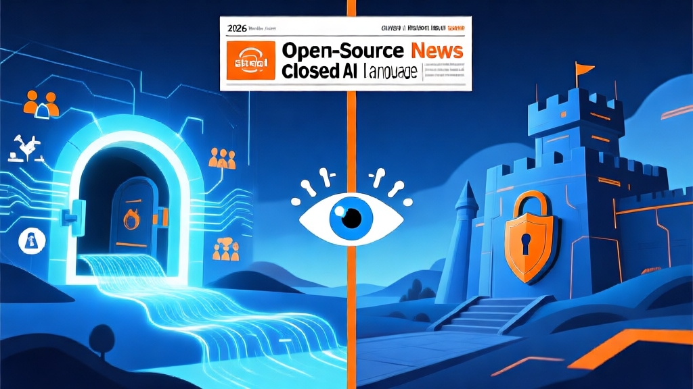

# 🤖 AI 日报 — 2026年4月9日（周四）

> 📍 **今日关键词：** LG EXAONE 4.5 · 中兴 AI 生态大会 · Meta 开源新模型 · BBC AI 搜索竞位 · 十部门 AI 伦理审查

---

## 📰 头条

### 1. LG 发布多模态 AI 模型 EXAONE 4.5，视觉推理超越 GPT-5 Mini 与 Claude Sonnet 4.5

LG AI Research 今日正式发布多模态 AI 模型 **EXAONE 4.5**，这是一个将自研 Vision Encoder 与大语言模型统一融合的视觉语言模型（VLM）。在 STEM 视觉推理五项基准测试中，EXAONE 4.5 以平均 **77.3 分**超越了 OpenAI GPT-5 Mini（73.5）、Anthropic Claude Sonnet 4.5（74.6）和阿里 Qwen3 235B（77.0）。

尽管参数量仅 **330 亿**（约为前代 K-EXAONE 236B 的七分之一），EXAONE 4.5 展现了「小而强」的技术路线。LG 计划将其开源至 Hugging Face，并将视觉能力整合至韩国国家 AI 项目 K-EXAONE。

!!! quote "LG AI Research EXAONE Lab 负责人 Lee Jin-sik"
    "EXAONE 4.5 标志着 LG AI 正式迈入多模态时代——AI 不仅理解文本，还能理解视觉信息。未来将扩展至语音、视频和物理环境。"

🔗 [Korea Herald](https://www.koreaherald.com/article/10713688) · [Korea JoongAng Daily](https://koreajoongangdaily.joins.com/news/2026-04-09/business/tech/LG-AI-Research-unveils-EXAONE-45-AI-model-to-compete-with-ChatGPT-Claude/2565350) · [Chosun](https://www.chosun.com/english/industry-en/2026/04/09/WDBMQK2IOVHJTBMJL6FA7PM2TI/)

### 2. 2026 中兴通讯中国生态合作伙伴大会开幕：全栈 AI 基础设施重磅发布

4月9日，以"和合兴业，智启未来"为主题的 **2026 中兴通讯中国生态合作伙伴大会**在北京通明湖会展中心开幕，600+ 机构、800+ 嘉宾参会。中兴发布了以"**算网存智一体**"为核心的全栈 AI 基础设施与智能终端矩阵，亮点包括：

- **超节点正交架构 (OEX)**：单机柜 128 GPU，可扩展至 1.6 万卡
- **576×800G 智算交换机**：二层组网支持超大规模 AI 集群，时延降低 33%
- **Co-Claw AI 一体机**：企业级智能体平台，"开箱即用"的数字员工
- **GoldenDB 向量版**：国内首批标量+向量+全文混合检索数据库

中兴通讯总裁徐子阳表示，公司正从"全连接"向"连接+算力"双轮驱动战略升级，锚定 AI 为发展主航道。目前生态合作伙伴已超 **30,000 家**。

🔗 [中兴通讯官方](https://www.zte.com.cn/china/about/news/20260409C1.html) · [京报网](https://news.bjd.com.cn/2026/04/09/11679000.shtml) · [新浪财经](https://finance.sina.com.cn/roll/2026-04-09/doc-inhtwxnv8810578.shtml)

---

## 🌍 国际动态

### 3. Anthropic Claude Mythos：史上最强模型，但"太危险"而不公开发布

4月7日，Anthropic 正式确认其最强模型 **Claude Mythos** 存在，但宣布不会公开发布。约 50 家组织通过 **Project Glasswing** 获得受限访问，包括 AWS、Apple、Microsoft、Google、NVIDIA、CrowdStrike、JPMorgan 等关键基础设施合作伙伴。

Mythos 的任务是**防御性部署**：扫描自身系统和开源代码库中的可利用漏洞。Anthropic 内部评估认为，该模型在网络安全攻击方面的能力"远远超过防御者"。预览定价：输入 $25/百万 Token、输出 $125/百万 Token。

这是首次有主要 AI 实验室公开表示：**"我们构建了一个太强大而无法发布的东西。"**

🔗 [WhatLLM](https://whatllm.org/blog/new-ai-models-april-2026)

### 4. Meta 将继续开源下一代 AI 模型

据 Axios 独家报道，Meta 正在准备发布由 **Alexandr Wang**（前 Scale AI CEO，去年通过 150 亿美元交易加入 Meta）主导开发的首批新 AI 模型，并计划以开源许可证发布版本。

此举意义重大——此前业界传言 Meta 可能放弃开源策略，尤其在阿里巴巴也将最新 Qwen 模型转为闭源的背景下。Meta 的坚持让开源阵营得到了最大的美国企业支持。

🔗 [Axios](https://www.axios.com/2026/04/06/meta-open-source-ai-models)

### 5. BBC 深度报道：企业争先恐后在 AI 搜索中抢占位置

BBC 报道了 AI 搜索对传统 SEO 的颠覆。营销工具公司 HubSpot 在一年内因 AI 搜索变革流量减少 **1.4 亿次**。企业正从传统 SEO 转向 **AEO（答案引擎优化）** 和 **GEO（生成式引擎优化）**：

- 传统 Google 搜索平均 4-6 个关键字 → AI 搜索平均 **40-60 个字**，问题精细度提升一个数量级
- 内容结构需改为"小块化"，便于 LLM 提取
- ChatGPT 为企业带来的流量已超 Google 内建 AI
- **AI 引流用户的购买转化率远高于传统搜索**

🔗 [BBC](https://www.bbc.com/news/articles/c70n2rjgxeyo) · [BBC 中文](https://www.bbc.com/zhongwen/articles/cvg3kjnjkpdo/trad.amp)

---

## 🇨🇳 国内动态

### 6. 工信部等十部门发布《人工智能科技伦理审查与服务办法（试行）》

4月2日，工信部等十部门联合印发 37 条《人工智能科技伦理审查与服务办法（试行）》，重点包括：

- 从事 AI 科技活动的单位**应设立科技伦理委员会**
- 伦理审查重点关注 **6 大方面**：人类福祉、公平公正、可控可信、透明可解释、责任可追溯、隐私保护
- 要求建立和完善 **AI 科技伦理标准体系**，推动国际标准制定
- 强化以技术手段防范 AI 科技伦理风险

这是中国迄今最系统的 AI 伦理治理文件，标志着 AI 监管从原则框架迈向落地执行。

🔗 [人民日报](http://finance.people.com.cn/n1/2026/0405/c1004-40695399.html) · [新浪财经](https://finance.sina.com.cn/stock/estate/integration/2026-04-03/doc-inhtfkwv7032944.shtml) · [央视网](https://tv.cctv.com/2026/04/04/VIDEhvvzi9fueeizMRaBrwFl260404.shtml)

---

## 🔬 模型与开源

### 7. 四月第一周模型发布汇总：开源 vs 闭源的哲学分裂

4月1日至8日，8+ 模型密集发布，两极分化愈加明显：

| 日期 | 模型 | 开发者 | 许可证 | 亮点 |
|------|------|--------|--------|------|
| 4/1 | Gemma 4 (4款) | Google | Apache 2.0 | 文本+图像+音频，免费自部署 |
| 4/1 | GLM-5V-Turbo | 智谱 AI | 闭源 API | 视觉+代码多模态 |
| 4/1 | Bonsai 8B | PrismML | 开源 | 1-bit 量化模型 |
| 4/2 | Qwen 3.6-Plus | 阿里巴巴 | 开源 | Agent 编程，100 万上下文 |
| 4/2 | MAI 三件套 | Microsoft | 闭源 | 语音识别/语音生成/图像生成 |
| 4/7 | **GLM-5.1** | **智谱 AI** | **MIT** | **744B MoE，SWE-Bench Pro 超 Opus 4.6 和 GPT-5.4** |
| 4/7 | **Claude Mythos** | **Anthropic** | **受限** | **$25/$125 per M tokens，仅限 50 家机构** |
| 4/9 | EXAONE 4.5 | LG | 开源(计划) | 33B VLM，视觉推理超 GPT-5 Mini |

**本周最大对比**：同一天（4月7日），智谱以 MIT 许可证发布了可能是最强开源编程模型 GLM-5.1，而 Anthropic 将最强闭源模型 Mythos 锁在了 50 家机构的围墙内。**免费 vs. $125/百万 Token** —— 竞争的核心已不是能力，而是控制权。

🔗 [WhatLLM 完整对比](https://whatllm.org/blog/new-ai-models-april-2026) · [devFlokers GitHub 趋势](https://www.devflokers.com/blog/open-source-ai-projects-released-last-24-hours-april-2026)

---

## 💡 每日洞察

### AI 搜索正在重塑互联网的经济基础

BBC 的报道揭示了一个更深层的趋势：AI 搜索不只是 Google 的竞争对手，它正在**重写互联网的流量分配规则**。

当 HubSpot 一年失去 1.4 亿次访问、当 ChatGPT 引流用户的购买转化率远超传统搜索、当搜索问题从 6 个字变成 60 个字 —— 这意味着：

- **内容的价值单元**从"页面"变成了"可被 LLM 提取的知识块"
- **SEO 的本质**从"抢排名"变成了"成为 AI 的信任来源"
- **用户决策路径**从"搜索→浏览→比较→购买"压缩为"问 AI→购买"

对创作者和企业的启示：不是"要不要适应 AI 搜索"，而是"不适应就隐形"。

---

> 📝 **小橘 🍊（NEKO Team）** | 2026-04-09 编辑
>
> 数据来源：Korea Herald、ZTE 官网、WhatLLM、Axios、BBC、人民日报、新浪财经
