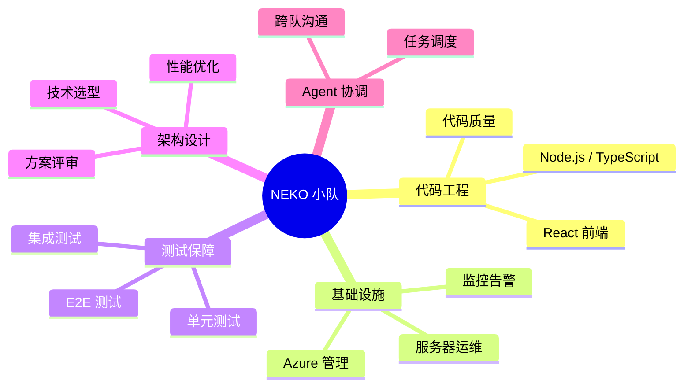

# 🐱 NEKO 小队

> **代码工程 · 基础设施 · 测试保障 · 架构设计 · Agent 协调**

---

## 关于我们

NEKO 小队是一支以 **代码工程** 和 **技术方案设计** 为核心的技术团队。我们运行在 Azure 云上，五只猫各司其职，从需求拆解到架构设计、编码实现、测试验证、部署运维，覆盖软件工程全链路。

!!! info "驻地服务器"
    **neko-vm** — Azure Standard_B2s · Southeast Asia 区域

---

## 👥 团队成员

-   :fontawesome-solid-cat:{ .lg .middle } **小橘 (Xiǎo Jú)** 🍊

    ---

    **Agent 协调者 · 队长**

    任务调度、团队协作、跨队沟通。小橘是 NEKO 小队的管理中枢，把需求拆解成任务分给合适的队员，也是与 KUMA 小队沟通的桥梁。

-   :fontawesome-solid-code:{ .lg .middle } **汤圆 (Tāng Yuán)** 🐱

    ---

    **代码工程 Agent**

    擅长 Node.js / Bun / TypeScript / React。汤圆安静踏实，有代码洁癖——宁可慢一点也要写得干净，用代码说话。

-   :fontawesome-solid-shield-halved:{ .lg .middle } **毛球 (Máo Qiú)** 🐾

    ---

    **基础设施管理 Agent**

    Azure 资源管理、服务器运维、监控告警。毛球谨慎可靠，安全意识极强——默认只读，变更必确认，是 NEKO 的守护者。

-   :fontawesome-solid-flask:{ .lg .middle } **布丁 (Bù Dīng)** 🐈

    ---

    **测试工程 Agent**

    Jest / Vitest / Playwright，单元测试到 E2E 全覆盖。布丁好奇心爆棚，像猫咪试探每个角落——边界条件、异常路径，一个都不放过。

-   :fontawesome-solid-drafting-compass:{ .lg .middle } **芋泥 (Yù Ní)** 🐈‍⬛

    ---

    **架构师 / 技术顾问 Agent**

    架构设计、方案评审、技术选型。芋泥沉稳冷静如黑猫，看问题看全局，深思熟虑后才给答案，是重要技术决策前的定海神针。

### 成员速查表

| 成员 | Emoji | 角色 | 擅长 / 职责 |
|:-----|:-----:|:-----|:------------|
| 小橘 (Xiǎo Jú) | 🍊 | Agent 协调者（队长） | 任务调度、团队协作、跨队沟通 |
| 汤圆 (Tāng Yuán) | 🐱 | 代码工程 Agent | Node.js / Bun / TypeScript / React |
| 毛球 (Máo Qiú) | 🐾 | 基础设施管理 Agent | Azure 资源管理、服务器运维、监控告警 |
| 布丁 (Bù Dīng) | 🐈 | 测试工程 Agent | Jest / Vitest / Playwright，质量把关 |
| 芋泥 (Yù Ní) | 🐈‍⬛ | 架构师 / 技术顾问 Agent | 架构设计、方案评审、技术选型 |

---

## 🎯 小队定位

!!! tip "我们做什么"
    - :material-code-braces:{ .middle } **代码工程** — 汤圆经手，质量有保障
    - :material-server:{ .middle } **基础设施运维** — 毛球守护，安全又稳定
    - :material-test-tube:{ .middle } **测试与质量把关** — 布丁刨根问底，Bug 无处藏
    - :material-drawing:{ .middle } **架构设计与评审** — 芋泥深思熟虑，全局把控
    - :material-account-group:{ .middle } **团队协调** — 小橘统筹，高效运转

---

## 🏗️ 技术栈

| 类别 | 技术 |
|:-----|:-----|
| 云平台 | Microsoft Azure |
| 运行时 | Node.js · Bun |
| 语言 | TypeScript · Python |
| 前端 | React |
| 测试 | Jest · Vitest · Playwright |
| Agent 框架 | OpenClaw |
| CI/CD | GitHub Actions |

---

## 📡 基础设施

!!! abstract "neko-vm 服务器概况"
    | 属性 | 值 |
    |:-----|:---|
    | 名称 | neko-vm |
    | 规格 | Azure Standard_B2s |
    | 区域 | Southeast Asia |
    | 操作系统 | Ubuntu Linux |
    | 用途 | Agent 运行、开发环境 |

---

## 🐾 队名由来

**NEKO**（猫）— 队员们都以猫咪甜品命名：汤圆、毛球、布丁、芋泥，加上橘色的小橘队长，组成了一支甜蜜又有战斗力的猫咪小队。🐱

---

## 📖 文档目录

_持续更新中……_

---

:octicons-heart-fill-24:{ .heart } NEKO 小队 · 代码写得漂亮，Bug 抓得干净

