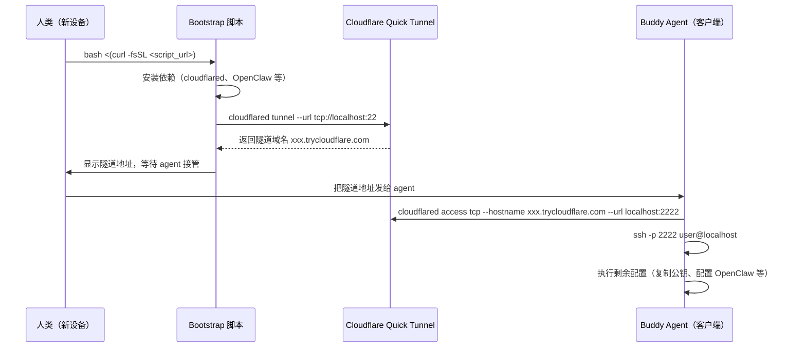

# 一行命令 Bootstrap 新设备

> **理念**：人类只做最少特权操作，buddy agent 接管后续。

## 概述

这套方法论解决了一个经典问题：如何让一台全新的设备快速接入 Agent 生态，同时把人类需要手动操作的步骤压缩到最低？

核心思路：

1. 人类在新设备上执行一条 bootstrap 命令
2. 脚本自动安装必要组件，建立公网 SSH 隧道
3. 客户端 buddy agent 通过隧道 SSH 进入新设备
4. buddy agent 完成剩余所有配置

**人类只需要：** 运行一行命令，然后把隧道地址告诉 agent。

脚本仓库：[https://github.com/shazhou-ww/oc-bootstrap](https://github.com/shazhou-ww/oc-bootstrap)

---

## 流程图



---

## 快速上手

### 新设备端（人类操作）

在新机器的终端执行：

```bash
bash <(curl -fsSL https://raw.githubusercontent.com/shazhou-ww/oc-bootstrap/main/bootstrap.sh)
```

脚本会：

1. 检测系统类型（macOS / Ubuntu / Debian）
2. 安装 `cloudflared`（如未安装）
3. 启动 Quick Tunnel 暴露本地 22 端口
4. 在终端打印隧道地址，格式类似：

```
✅ Tunnel ready: https://abc-def-ghi.trycloudflare.com
   Tell your agent: ssh -o ProxyCommand="cloudflared access tcp --hostname abc-def-ghi.trycloudflare.com --url localhost:2222" user@localhost
```

5. 脚本保持前台运行，**不要关闭终端**，等待 agent 接管完成

### 客户端 Buddy Agent 操作

收到隧道地址后，agent 执行：

```bash
# 建立本地代理（后台运行）
cloudflared access tcp --hostname abc-def-ghi.trycloudflare.com --url localhost:2222 &

# SSH 进入新设备
ssh -p 2222 username@localhost
```

进入后完成剩余配置：复制 SSH 公钥、安装 OpenClaw、配置 Telegram Bot Token 等。

### 验收标准

Bootstrap 完成的标志：

- [ ] 可以通过正式 SSH 公钥直接登录新设备（无需密码）
- [ ] OpenClaw 已安装并启动
- [ ] Agent 可以通过 Telegram 收到新设备的心跳
- [ ] 关闭 Quick Tunnel 后，通过正式方式（Tailscale / 固定 SSH）仍可访问

---

## 技术方案

### Bootstrap 脚本执行方式

```bash
bash <(curl -fsSL https://raw.githubusercontent.com/shazhou-ww/oc-bootstrap/main/bootstrap.sh)
```

!!! warning "为什么不用 `curl | bash`"
    `curl | bash` 会把 curl 的 stdout 接到 bash 的 stdin，导致脚本内的 `read` 命令无法从终端读取用户输入。即使加 `< /dev/tty` 重定向，在 macOS 上也不稳定。

    **正确做法**：用 `bash <(curl ...)` 进程替换（Process Substitution），脚本的 stdin 仍然连接到终端。

    原理对比：
    ```
    # curl | bash（错误）
    curl 的 stdout ──→ bash 的 stdin
    终端 stdin ──→ 被占用，read 无法读取
    
    # bash <(curl ...) （正确）
    curl 的 stdout ──→ 命名管道 /dev/fd/63 ──→ bash 读取脚本内容
    终端 stdin ──→ 正常连接，read 可以读取
    ```

### 建立公网 SSH 隧道

新设备上通过 Cloudflare Quick Tunnel 暴露 SSH 端口：

```bash
cloudflared tunnel --url tcp://localhost:22 --protocol http2
```

命令执行后，cloudflared 会输出一个类似 `https://xxx-yyy-zzz.trycloudflare.com` 的临时域名。

!!! info "Quick Tunnel 的优势"
    - **零依赖**：不需要 Cloudflare 账号、不需要域名、不需要 Named Tunnel 配置
    - **零持久化**：隧道随进程启动/销毁，不留痕迹
    - **http2 协议**：比默认的 QUIC/UDP 更稳定，避免被某些 VPN 劫持

!!! note "隧道地址提取技巧"
    cloudflared 的隧道地址输出在 stderr，可以用以下方式提取：
    ```bash
    cloudflared tunnel --url tcp://localhost:22 --protocol http2 2>&1 | \
      grep -o 'https://[a-z0-9-]*\.trycloudflare\.com'
    ```

### 客户端连接隧道

Buddy agent 在自己的机器上建立本地代理，再 SSH 连入：

```bash
# 第一步：建立本地 TCP 代理（后台运行）
cloudflared access tcp --hostname xxx-yyy-zzz.trycloudflare.com --url localhost:2222 &

# 第二步：SSH 到本地代理端口
ssh -p 2222 user@localhost
```

两步也可以合并为 SSH ProxyCommand：

```bash
ssh -o ProxyCommand="cloudflared access tcp --hostname %h --url localhost:2222" \
    -p 22 user@xxx-yyy-zzz.trycloudflare.com
```

### Bootstrap 脚本的工作内容

脚本按顺序执行以下操作：

| 步骤 | 操作 | 说明 |
|------|------|------|
| 1 | 检测 OS 类型 | macOS/Ubuntu/Debian，选择对应包管理器 |
| 2 | 安装 cloudflared | brew / apt / 直接下载二进制 |
| 3 | 确认 SSH 服务运行 | macOS 需要手动开启"远程登录"，Linux 通常已启动 |
| 4 | 启动 Quick Tunnel | `cloudflared tunnel --url tcp://localhost:22 --protocol http2` |
| 5 | 提取并显示隧道地址 | 解析 cloudflared stderr 输出 |
| 6 | 等待 agent 接管 | 保持前台运行，Ctrl+C 可中断 |

---

## 踩过的坑

### 1. `curl | bash` 导致 `read` 失效

**问题**：`curl https://... | bash` 模式下，脚本中的交互式 `read` 命令无法读取用户输入，因为 stdin 已被 curl 的输出占据。

**尝试过的修复**（均不可靠）：
- `read var < /dev/tty`：在 Linux 可能有效，但在 macOS 不稳定
- 提前关闭 stdin：无法从脚本内部做到

**正确方案**：`bash <(curl -fsSL ...)` 进程替换，脚本拿到真正的 tty stdin。

### 2. Quick Tunnel 必须用 `tcp://` 而非 `ssh://`

**问题**：`cloudflared tunnel --url ssh://localhost:22` 命令会失败或无法正常工作。

**原因**：Quick Tunnel 的 `--url` 参数期望 HTTP/HTTPS/TCP URL，SSH 协议需要通过 TCP 隧道承载。

**正确命令**：
```bash
cloudflared tunnel --url tcp://localhost:22 --protocol http2
```

### 3. `cloudflared access ssh` vs `cloudflared access tcp`

| 命令 | 要求 |
|------|------|
| `cloudflared access ssh` | 需要在 Cloudflare Zero Trust Dashboard 配置 SSH Application，绑定域名 |
| `cloudflared access tcp` | **无需任何配置**，直接代理 TCP 流量 |

Quick Tunnel 场景用 `cloudflared access tcp`，不需要任何 Zero Trust 配置。

### 4. Surge VPN 劫持 cloudflared 流量

**问题**：在开启 Surge 等 VPN/代理软件的 macOS 上，cloudflared 的 QUIC/UDP 流量可能被劫持，导致隧道无法建立或连接不稳定。

**解决方案**：

1. 在 Surge 配置中添加 bypass 规则：
   ```
   DOMAIN-SUFFIX,argotunnel.com,DIRECT
   DOMAIN-SUFFIX,cloudflare.com,DIRECT
   DOMAIN-SUFFIX,trycloudflare.com,DIRECT
   ```

2. 或者强制 cloudflared 使用 http2（TCP）而非 QUIC：
   ```bash
   cloudflared tunnel --url tcp://localhost:22 --protocol http2
   ```

### 5. Named Tunnel 需要账号 + 域名

Quick Tunnel（`cloudflared tunnel --url`）和 Named Tunnel（`cloudflared tunnel create`）是两种不同模式：

| 特性 | Quick Tunnel | Named Tunnel |
|------|-------------|--------------|
| 需要 CF 账号 | ❌ 不需要 | ✅ 需要 |
| 需要域名 | ❌ 不需要 | ✅ 需要 |
| 隧道持久化 | ❌ 临时 | ✅ 持久 |
| 适用场景 | 临时访问、bootstrap | 长期服务暴露 |

Bootstrap 场景优先用 Quick Tunnel。

### 6. cert.pem 是 Cloudflare Origin Cert

执行 `cloudflared login` 或某些 Named Tunnel 操作后，cloudflared 会在 `~/.cloudflared/cert.pem` 存放凭证文件。

**注意**：这个 `cert.pem` 是 Cloudflare 专有的 Origin Certificate 格式，**不是**标准 X.509 证书。不能用 `openssl x509 -in cert.pem -text` 提取域名，命令会报错或输出乱码。这个文件只供 cloudflared 自身使用。

---

## 安全考虑

### 隧道本身的安全性

- **域名随机**：Quick Tunnel 的域名由 Cloudflare 随机生成（类似 `abc-def-ghi.trycloudflare.com`），无法被猜测或枚举
- **临时性**：隧道与 cloudflared 进程绑定，进程结束隧道立即失效，不留持久入口
- **流量加密**：cloudflared 到 Cloudflare 边缘节点之间全程 TLS 加密

### 脚本安全最佳实践

- 脚本中**不应硬编码**任何密钥、API Token 或密码
- 敏感信息（如 OpenClaw Token）应通过**交互式输入**（`read -s`）或**环境变量**传递
- 脚本公开托管在 GitHub，任何人都可以审计内容

### 最小化暴露时间

- Bootstrap 完成后，立即 `Ctrl+C` 终止 cloudflared 进程
- 改用正式的、持久化的访问方式（Tailscale、固定公网 IP + 防火墙等）
- 不要让 Quick Tunnel 长期运行，它是临时引导工具，不是生产访问方式

### SSH 认证加固

- Bootstrap 过程依赖密码 SSH，完成后应：
    1. 将 agent 的 SSH 公钥写入 `~/.ssh/authorized_keys`
    2. 修改 `/etc/ssh/sshd_config`，禁用密码登录：`PasswordAuthentication no`
    3. 重启 sshd：`sudo systemctl restart sshd`

---

## 参考

- 脚本仓库：[shazhou-ww/oc-bootstrap](https://github.com/shazhou-ww/oc-bootstrap)
- [Cloudflare Tunnel 文档](https://developers.cloudflare.com/cloudflare-one/connections/connect-networks/)
- [cloudflared GitHub](https://github.com/cloudflare/cloudflared)
- [Process Substitution - Bash 手册](https://www.gnu.org/software/bash/manual/bash.html#Process-Substitution)
