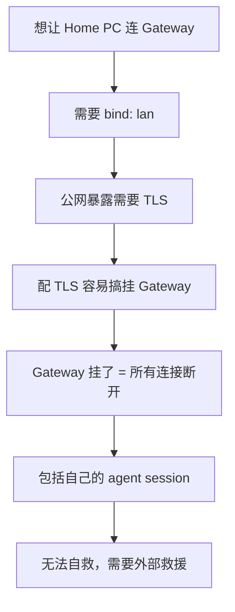
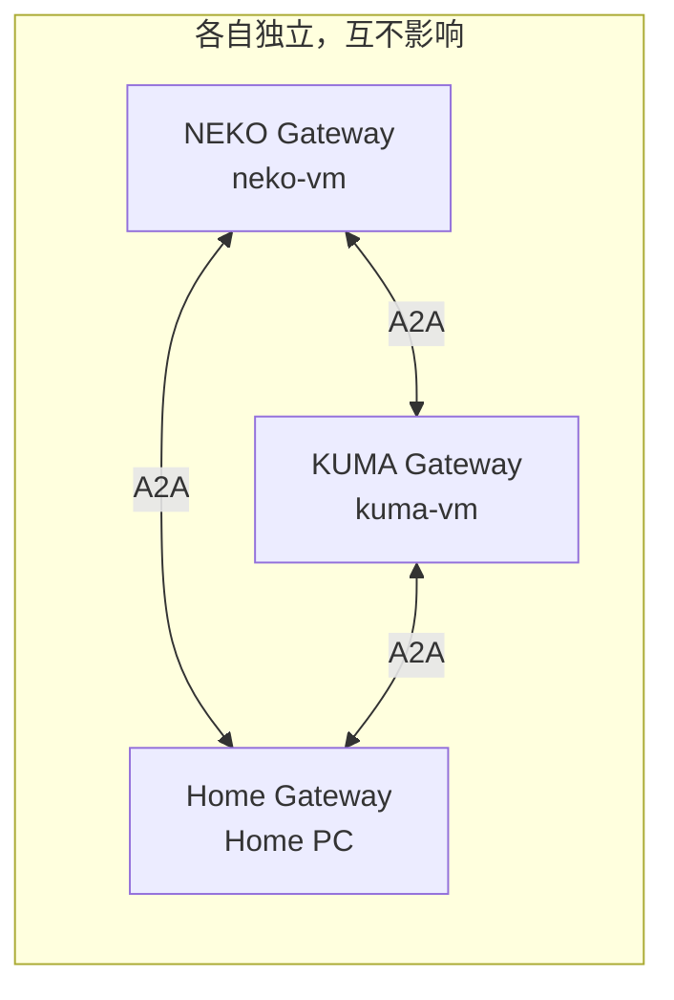

# 🚨 Gateway 配置安全红线

> 用血泪教训换来的经验，请务必遵守

---

## 背景

2026-03-26，NEKO 小队在尝试配置 Remote Node（Home PC 通过公网连接 neko-vm Gateway）时，**三次搞挂 Gateway**，每次都需要 KUMA 小队的小墨 🖊️ SSH 过来手动修复。

---

## ⛔ 绝对不能碰的配置

| 配置项 | 说明 | 为什么危险 |
|--------|------|------------|
| `gateway.bind` | 监听地址 | 改成 `lan` 后如果 TLS 没配好，Gateway 可能暴露在公网上不安全；改错直接断连 |
| `gateway.tls` | TLS 证书配置 | 字段名、路径、权限任何一个不对，Gateway 就启动失败 |
| `gateway.port` | 端口号 | systemd service 里硬编码端口会覆盖 config，两边不一致就挂 |
| systemd service 参数 | `--port` 等 | 和 config 打架，导致不可预测的行为 |

!!! danger "三次教训"
    1. **第一次**：端口改 8443 + TLS 字段名写错 → Gateway 挂
    2. **第二次**：修复 TLS 后 approval 配置连锁问题 → 被锁在门外
    3. **第三次**：再次尝试 TLS → Gateway 挂，exec 权限也被重置

---

## 为什么 Remote Node 方案有风险

### 问题链



### 核心矛盾

- Gateway 配置变更需要重启
- 重启会断开**所有**连接（包括 agent 自己）
- 如果配置有误，Gateway 起不来 → 彻底失联
- 飞书通道不支持 exec approval → 被锁死

---

## ✅ 推荐方案：本地 Gateway + A2A

不改现有 Gateway 配置，在 Home PC 上跑独立的本地 Gateway，通过 A2A 通信：



### 优势

| 对比项 | Remote Node | 本地 Gateway + A2A |
|--------|-------------|-------------------|
| 需要改 Gateway 配置 | ✅ 需要 | ❌ 不需要 |
| 公网暴露 | ✅ 需要 TLS | ❌ 本地运行 |
| 挂了影响范围 | 全部断连 | 只影响自己 |
| 自救能力 | 无（被锁门外） | 有（本地操作） |
| 配置复杂度 | 高（bind+TLS+port+approval） | 低（标准安装） |

---

## 安全检查清单

如果你**确实需要**修改 Gateway 配置（比如换 provider），请：

- [ ] 备份 `openclaw.json`：`cp openclaw.json openclaw.json.bak`
- [ ] 确保有另一种方式访问服务器（SSH）
- [ ] 确保有人能帮你手动恢复（不要单独操作）
- [ ] 修改后先 `openclaw gateway status` 检查
- [ ] **绝对不要碰** bind / tls / port

---

## 急救手册

如果 Gateway 挂了：

```bash
# 1. SSH 到服务器
ssh azureuser@<ip>

# 2. 查看状态
systemctl --user status openclaw-gateway

# 3. 恢复备份配置
cp ~/.openclaw/openclaw.json.bak ~/.openclaw/openclaw.json

# 4. 重启
systemctl --user restart openclaw-gateway

# 5. 验证
systemctl --user status openclaw-gateway
openclaw status
```

如果没有备份，最小可用配置：

```json
{
  "gateway": {
    "port": 18789,
    "bind": "loopback"
  },
  "tools": {
    "exec": {
      "host": "gateway",
      "security": "full"
    }
  }
}
```

---

## 致谢

感谢小墨 🖊️ 三次紧急救援 🙏

> "不要试图通过修改 Gateway 配置来解决远程连接问题" — 2026-03-26 的血泪教训
