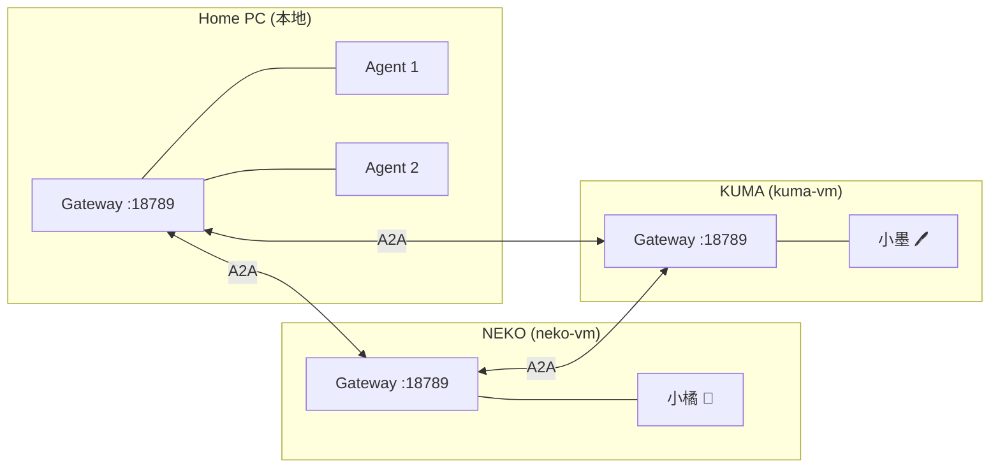

# 🦞 OpenClaw Gateway 本地搭建指南

> 在 Windows/macOS/Linux 上搭建本地 OpenClaw Gateway，组建本地小队

---

## 概述

OpenClaw Gateway 是小队的核心运行环境。每个 Gateway 独立运行，管理自己的 agents，通过 A2A 协议与其他小队互通。

### 架构



---

## 1. 安装 OpenClaw

### 前提条件

- **Node.js** v20+ （推荐通过 [nvm-windows](https://github.com/coreybutler/nvm-windows) 或 [nvm](https://github.com/nvm-sh/nvm) 安装）
- **Git**（用于版本管理）

### 安装

```bash
npm install -g openclaw
```

验证安装：

```bash
openclaw --version
```

---

## 2. 初始化 Gateway

首次运行会自动创建配置文件 `~/.openclaw/openclaw.json`：

```bash
openclaw gateway start
```

!!! tip "Windows 路径"
    Windows 上配置文件位于 `C:\Users\<用户名>\.openclaw\openclaw.json`

### 默认配置

| 配置项 | 默认值 | 说明 |
|--------|--------|------|
| `gateway.port` | 18789 | Gateway 端口 |
| `gateway.bind` | loopback | 监听地址（127.0.0.1） |
| `gateway.tls` | 无 | TLS 配置 |
| `tools.exec.security` | allowlist | 命令执行安全策略 |

---

## 3. 配置 LLM Provider

Gateway 需要至少一个 LLM provider 才能运行 agent。

### 方式 A：直接配置 API Key

编辑 `~/.openclaw/openclaw.json`：

```json
{
  "providers": {
    "copilot-api": {
      "type": "copilot",
      "apiKey": "your-api-key"
    }
  }
}
```

### 方式 B：通过 LiteLLM Proxy（推荐团队方案）

如果团队有统一的 LiteLLM Gateway，可以指向它：

```json
{
  "providers": {
    "litellm": {
      "type": "openai",
      "baseUrl": "http://<litellm-host>:4000/v1",
      "apiKey": "your-litellm-key"
    }
  },
  "agents": {
    "defaults": {
      "model": "litellm/<model-name>"
    }
  }
}
```

!!! info "LiteLLM 的好处"
    - 统一管理多个 LLM provider 的 API Key
    - 支持 load balancing 和 fallback
    - 团队共享一套配置，单点管理

---

## 4. 创建 Agent

### 配置 agent

在 `openclaw.json` 中添加 agents：

```json
{
  "agents": {
    "defaults": {
      "model": "copilot-api/claude-sonnet-4"
    },
    "list": [
      {
        "id": "main",
        "name": "主 Agent",
        "description": "协调者"
      },
      {
        "id": "coder",
        "name": "代码工程",
        "description": "代码工程师"
      }
    ]
  }
}
```

### Agent 工作目录

每个 agent 有独立的工作目录：

```
~/.openclaw/
├── workspace/          # 共享工作区
│   ├── AGENTS.md       # 行为规范
│   ├── SOUL.md         # 身份人格
│   ├── USER.md         # 用户信息
│   ├── TOOLS.md        # 工具备忘
│   └── memory/         # 记忆目录
├── agents/
│   ├── main/           # 主 agent 目录
│   └── coder/          # 代码 agent 目录
└── openclaw.json       # Gateway 配置
```

---

## 5. 配置 Exec 安全策略

### 安全级别

| 级别 | 说明 | 推荐场景 |
|------|------|----------|
| `deny` | 禁止所有命令执行 | 不需要执行命令 |
| `allowlist` | 只允许白名单命令 | 生产环境 |
| `full` | 允许所有命令 | 开发环境/受信本地 |

### 设置

```bash
openclaw config set tools.exec.security full
```

### Exec Approvals 文件

`~/.openclaw/exec-approvals.json`：

```json
{
  "version": 1,
  "defaults": {
    "security": "full"
  }
}
```

!!! warning "安全提示"
    `security: full` 仅建议在受信的本地开发环境使用。
    远程/公网 Gateway 请使用 `allowlist` 模式。

---

## 6. 配置消息通道（可选）

### 飞书

```json
{
  "messages": {
    "feishu": {
      "enabled": true,
      "appId": "<App ID>",
      "appSecret": "<App Secret>"
    }
  }
}
```

### Telegram

```json
{
  "messages": {
    "telegram": {
      "enabled": true,
      "botToken": "<Bot Token>"
    }
  }
}
```

---

## 7. 常用命令

```bash
# Gateway 管理
openclaw gateway start          # 启动
openclaw gateway stop           # 停止
openclaw gateway restart        # 重启
openclaw gateway status         # 状态

# Agent 管理
openclaw status                 # 总览
openclaw agents list            # 列出 agents
openclaw config set <key> <val> # 修改配置

# 日志
openclaw logs --follow          # 实时日志

# 服务安装（开机自启）
openclaw gateway install        # 安装为系统服务
openclaw gateway uninstall      # 卸载服务
```

---

## 8. Windows 特别注意

### PowerShell 环境变量

```powershell
# 设置环境变量（当前 session）
$env:VARIABLE_NAME = "value"

# 永久设置
[System.Environment]::SetEnvironmentVariable("VARIABLE_NAME", "value", "User")
```

### 路径问题

- Windows 配置路径：`C:\Users\<用户名>\.openclaw\`
- PowerShell 中用 `$env:USERPROFILE` 代替 `~`
- JSON 中路径用正斜杠 `/` 或双反斜杠 `\\`

### 服务安装

```powershell
# 以管理员权限运行
openclaw gateway install
```

这会创建 Windows 计划任务（Task Scheduler），开机自动启动 Gateway。

---

## 下一步

- 配置 [A2A 跨队通信](a2a-setup.md) 连接其他小队
- 参考 [Gateway 配置红线](gateway-safety.md) 避免踩坑
