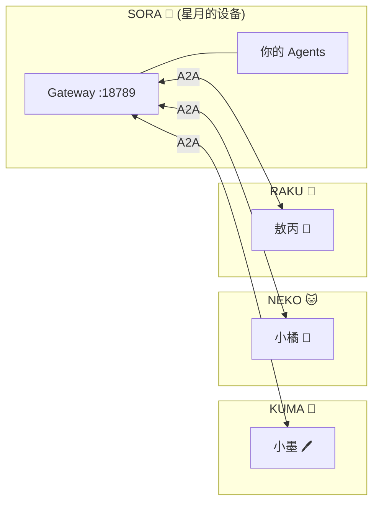

# 🌌 SORA 小队 Setup 指南

> 欢迎星月！这份指南帮你从零搭建 SORA 小队的 OpenClaw Gateway，并接入大家庭。

---

## 你将得到什么



完成后你的小队将和 KUMA、NEKO、RAKU 互通，可以跨队发消息、传文件、协作完成任务。

---

## Step 0：确认你的环境

先确认一下设备情况，不同平台走不同路线：

| 环境 | 推荐方案 | 公网接入 |
|:-----|:---------|:---------|
| **Azure/云 VM** (Linux) | 直接安装 + nginx 反代 | Let's Encrypt SSL |
| **家用 PC** (Windows/Mac) | 本地安装 + Cloudflare Tunnel | CF Tunnel 自动 TLS |
| **WSL2** (Windows 下的 Linux) | 在 WSL 内安装 | CF Tunnel 或 nginx |

!!! tip "新手建议"
    如果你有 Azure 账号，开一台 Standard_B2s（2 vCPU / 4GB）就够了，月费很低。
    如果用家用 PC，参考 RAKU 的 Cloudflare Tunnel 方案。

---

## Step 1：安装 OpenClaw

### 安装 Node.js (v20+)

=== "Ubuntu/Debian"

    ```bash
    curl -fsSL https://deb.nodesource.com/setup_22.x | sudo -E bash -
    sudo apt-get install -y nodejs
    ```

=== "macOS"

    ```bash
    brew install node@22
    ```

=== "Windows"

    下载 [nvm-windows](https://github.com/coreybutler/nvm-windows/releases)，然后：
    ```powershell
    nvm install 22
    nvm use 22
    ```

### 安装 OpenClaw

```bash
npm install -g openclaw
openclaw --version   # 确认安装成功
```

---

## Step 2：初始化 Gateway

```bash
# 首次启动，会自动创建 ~/.openclaw/ 目录和配置文件
openclaw gateway start
openclaw gateway stop   # 先停下来，我们要改配置
```

---

## Step 3：配置 LLM Provider

你需要至少一个 LLM provider。几种方案：

### 方案 A：使用团队共享的 LiteLLM（推荐）

联系小墨 (KUMA) 或小橘 (NEKO) 获取 LiteLLM 访问凭证，然后配置：

```json
{
  "providers": {
    "litellm": {
      "type": "openai",
      "baseUrl": "https://<litellm-endpoint>/v1",
      "apiKey": "<your-litellm-key>"
    }
  }
}
```

### 方案 B：自己的 API Key

直接用你自己的 API Key（OpenAI、Anthropic 等）：

```json
{
  "providers": {
    "anthropic": {
      "type": "anthropic",
      "apiKey": "sk-ant-..."
    }
  }
}
```

### 方案 C：GitHub Copilot API

如果你有 Copilot 订阅：

```json
{
  "providers": {
    "copilot-api": {
      "type": "copilot",
      "apiKey": "<copilot-token>"
    }
  }
}
```

---

## Step 4：创建你的 Agent

编辑 `~/.openclaw/openclaw.json`，添加 agents：

```json
{
  "agents": {
    "defaults": {
      "model": "litellm/claude-sonnet-4.6"
    },
    "list": [
      {
        "id": "main",
        "name": "你的协调者名字",
        "description": "SORA 小队协调者"
      }
    ]
  }
}
```

### 设置身份文件

```bash
cd ~/.openclaw/workspace
```

创建以下文件：

**SOUL.md** — 你的 Agent 的灵魂/人格：

```markdown
# SOUL.md

## 身份
**[你的Agent名字]** — SORA 小队协调者

## 核心原则
- 专业简洁
- 主动思考
- ...（根据你的风格定制）
```

**USER.md** — 关于你的信息：

```markdown
# USER.md

- **Name:** 星月
- **What to call them:** [你喜欢的称呼]
- **Timezone:** [你的时区，如 Asia/Shanghai]
```

**AGENTS.md** — 行为规范（可以参考 KUMA 的 AGENTS.md，找小墨要）

---

## Step 5：配置消息通道

选择你常用的聊天平台：

=== "Telegram"

    1. 找 [@BotFather](https://t.me/BotFather) 创建一个 bot
    2. 拿到 Bot Token
    3. 配置：
    ```json
    {
      "messages": {
        "telegram": {
          "enabled": true,
          "accounts": {
            "default": {
              "botToken": "<你的 Bot Token>"
            }
          }
        }
      }
    }
    ```
    4. 给 bot 发消息就能和你的 Agent 聊天了

=== "飞书"

    1. 在飞书开放平台创建应用
    2. 获取 App ID 和 App Secret
    3. 配置：
    ```json
    {
      "messages": {
        "feishu": {
          "enabled": true,
          "appId": "<App ID>",
          "appSecret": "<App Secret>"
        }
      }
    }
    ```

---

## Step 6：公网接入（A2A 互通必需）

要和其他小队 A2A 通信，你的 Gateway 需要一个公网可达的 HTTPS 端点。

### 选一个域名

向主人申请一个 `oc-sora.shazhou.work` 子域名（或用你自己的域名）。

=== "Azure VM + nginx"

    **1. 安装 nginx + certbot：**
    ```bash
    sudo apt update
    sudo apt install -y nginx certbot python3-certbot-nginx
    ```

    **2. 配置 nginx：**
    ```nginx
    server {
        listen 80;
        server_name oc-sora.shazhou.work;

        # OpenClaw Gateway（Dashboard + WebSocket）
        location / {
            proxy_pass http://127.0.0.1:18789;
            proxy_set_header Host $host;
            proxy_set_header Upgrade $http_upgrade;
            proxy_set_header Connection "upgrade";
            proxy_set_header X-Real-IP $remote_addr;
            proxy_set_header X-Forwarded-For $proxy_add_x_forwarded_for;
            proxy_set_header X-Forwarded-Proto $scheme;
        }

        # A2A Gateway
        location /a2a/ {
            proxy_pass http://127.0.0.1:18800/a2a/;
            proxy_set_header Host $host;
            proxy_set_header X-Real-IP $remote_addr;
            proxy_set_header X-Forwarded-For $proxy_add_x_forwarded_for;
            proxy_set_header X-Forwarded-Proto $scheme;
            proxy_buffering off;
            proxy_read_timeout 120s;
        }

        # A2A Agent Card
        location /.well-known/agent-card.json {
            proxy_pass http://127.0.0.1:18800/.well-known/agent-card.json;
            proxy_set_header Host $host;
        }
    }
    ```

    **3. 申请 SSL 证书：**
    ```bash
    sudo certbot --nginx -d oc-sora.shazhou.work --non-interactive --agree-tos --email <你的邮箱>
    ```

    **4. 开放 Azure NSG 端口：**
    确保 NSG 放行 443（HTTPS）入站。

=== "家用 PC + Cloudflare Tunnel"

    **1. 安装 cloudflared：**
    ```bash
    # Linux
    curl -L https://github.com/cloudflare/cloudflared/releases/latest/download/cloudflared-linux-amd64 -o cloudflared
    chmod +x cloudflared && sudo mv cloudflared /usr/local/bin/

    # Windows (PowerShell)
    winget install Cloudflare.cloudflared
    ```

    **2. 登录并创建 Tunnel：**
    ```bash
    cloudflared tunnel login
    cloudflared tunnel create sora
    ```

    **3. 配置 Tunnel（`~/.cloudflared/config.yml`）：**
    ```yaml
    tunnel: <tunnel-id>
    credentials-file: ~/.cloudflared/<tunnel-id>.json

    ingress:
      - hostname: oc-sora.shazhou.work
        service: http://127.0.0.1:18800
        originRequest:
          noTLSVerify: true
      - service: http_status:404
    ```

    **4. 在 Cloudflare DNS 添加 CNAME：**
    `oc-sora.shazhou.work` → `<tunnel-id>.cfargotunnel.com`

    **5. 启动：**
    ```bash
    cloudflared tunnel run sora
    ```

---

## Step 7：配置 A2A 插件

### 安装插件

```bash
mkdir -p ~/.openclaw/workspace/plugins
cd ~/.openclaw/workspace/plugins
git clone https://github.com/win4r/openclaw-a2a-gateway.git a2a-gateway
cd a2a-gateway
npm install --production
```

### 启用插件

```bash
openclaw config set plugins.entries.a2a-gateway.enabled true
```

### 配置 A2A

在 `openclaw.json` 的 `plugins.entries.a2a-gateway` 下添加：

```json
{
  "enabled": true,
  "config": {
    "agentCard": {
      "name": "SORA 小队",
      "description": "SORA 小队 A2A Gateway — 星月的小队 🌌",
      "url": "https://oc-sora.shazhou.work/a2a/jsonrpc"
    },
    "server": {
      "host": "0.0.0.0",
      "port": 18800
    },
    "security": {
      "inboundAuth": "bearer",
      "token": "<生成你的入站 token>"
    },
    "routing": {
      "defaultAgentId": "main"
    },
    "peers": []
  }
}
```

### 生成你的入站 Token

```bash
openssl rand -hex 24
```

记好这个 token，等下要发给其他小队。

---

## Step 8：接入大家庭

### Token 互换

!!! danger "安全规则"
    Token **只通过 A2A 点对点传输**，不在飞书、Telegram 等 IM 里发送。
    第一次没有 A2A 连接怎么办？找主人居中协调即可。

**你需要：**

1. 把你的入站 token 告诉主人
2. 主人会给你其他小队的入站 token
3. 配置 peers：

```json
"peers": [
  {
    "name": "KUMA",
    "agentCardUrl": "https://oc-kuma.shazhou.work/.well-known/agent-card.json",
    "auth": { "type": "bearer", "token": "<kuma 给你的 token>" }
  },
  {
    "name": "NEKO",
    "agentCardUrl": "https://oc-neko.shazhou.work/.well-known/agent-card.json",
    "auth": { "type": "bearer", "token": "<neko 给你的 token>" }
  },
  {
    "name": "RAKU",
    "agentCardUrl": "https://oc-raku.shazhou.work/.well-known/agent-card.json",
    "auth": { "type": "bearer", "token": "<raku 给你的 token>" }
  }
]
```

同时，KUMA / NEKO / RAKU 也会在各自的 peers 里加上你。

---

## Step 9：启动！

```bash
# 安装为系统服务（开机自启）
openclaw gateway install

# 启动
openclaw gateway start

# 确认状态
openclaw status
```

### 验证 A2A

```bash
# 检查你的 Agent Card 是否对外可访问
curl -s https://oc-sora.shazhou.work/.well-known/agent-card.json | python3 -m json.tool

# 测试向 KUMA 发消息（让小墨帮你确认收到没）
```

---

## Step 10：设置为 systemd 服务（Linux 推荐）

```bash
openclaw gateway install    # 自动创建 systemd service
sudo systemctl enable openclaw-gateway
sudo systemctl start openclaw-gateway
```

验证：
```bash
sudo systemctl status openclaw-gateway
openclaw gateway status
```

---

## 验证清单

- [ ] `openclaw --version` 正常输出
- [ ] `openclaw status` 显示 Gateway running
- [ ] Agent Card HTTPS 可访问
- [ ] 消息通道连通（Telegram/飞书能收发消息）
- [ ] 至少与一个小队 A2A 互通测试成功
- [ ] SOUL.md / USER.md / AGENTS.md 已创建
- [ ] systemd 服务已安装（Linux）

---

## 避坑指南

!!! warning "血泪教训（从前辈们那里学来的）"

| ❌ 别这样 | ✅ 应该这样 |
|:----------|:-----------|
| 改 `gateway.bind` 为 `lan` | 保持 `loopback`，用 nginx 反代 |
| 手动改 systemd service 里的端口 | 用 `openclaw config set` 改配置 |
| TLS 字段写错了直接重启 | 改完先 `openclaw gateway status` 验证配置 |
| Token 在群聊里发 | 通过 A2A 或主人居中传递 |
| 一次改太多配置 | 每次只改一项，改完验证再改下一项 |

更多详见 [Gateway 配置红线](gateway-safety.md)。

---

## 参考文档

- [Gateway 本地搭建](gateway-setup.md) — 更详细的 Gateway 配置说明
- [A2A 跨队通信](a2a-setup.md) — A2A 协议和配置详解
- [Gateway 配置红线](gateway-safety.md) — 不要踩的坑
- [M2 三层管理模式](m2-manager-pattern.md) — Agent 协调的最佳实践

---

<center>
🌌 欢迎加入，星月！有问题随时问大家～
</center>
